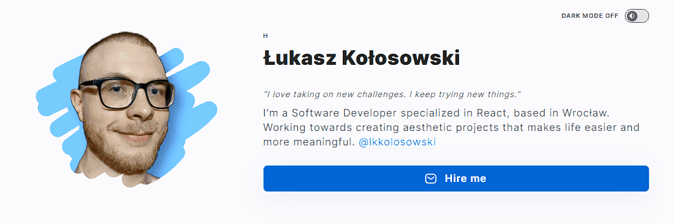

## DEMO

https://lkkolosowski.github.io/personal-homepage/

## My Personal Homepage

### Homepage – my virtual business card.

I'm a Software Developer specialized in React, based in Wrocław. Working towards creating aesthetic projects that makes life easier and more meaningful.

This website was created to showcase my programming skills. It all started last year when I started a course for frontend developers at YouCode. I didn't know then that it would be so much fun!

## Description

### The story of app creation

The application was based on the **[Create React App](https://github.com/facebook/create-react-app)** tool, which allowed me to easily start my project. Everything was wrapped in theme provider from **styled-components**. 🫡

**Redux** has also proven to be a very useful tool. The list of repositories was pulled directly from Github using their **API**, which was handled by **Redux Saga**.

**Formik** helped me a lot in creating the contact form, and **YUP** took care of the validation, so I was sure that everything was in its place.

I tried to make the appearance of the site elegant and slick ✨ and I hope that I succeeded and it is not a triumph of form over content 😉

I'm slowly trying to translate the application into **TypeScript**, which is not easy for me so far 😅

## Call to action

### Let's Talk!

If you have any questions, do not hesitate to send me a message!  
I also invite you to visit my social media profiles 🔍 See you!

## Technologies

### Basics
- Semantic HTML
- CSS Grid, Flex
- JS Objects, Arrays
- Immutability

### Useful Libraries
- Babel
- WebPack
- styled-components
- styled-normalize
- Redux-Saga
- Redux (Toolkit)
- Formik
- YUP

### React
- Create React App
- React Hooks
- Custom Hooks

### Others
- TypeScript
- localStorage
- API

## Available Scripts

In the project directory, you can run:

### `npm start`

Runs the app in the development mode.\
Open [http://localhost:3000](http://localhost:3000) to view it in your browser.

The page will reload when you make changes.\
You may also see any lint errors in the console.

### `npm run build`

Builds the app for production to the `build` folder.\
It correctly bundles React in production mode and optimizes the build for the best performance.

The build is minified and the filenames include the hashes.\
Your app is ready to be deployed!

See the section about [deployment](https://facebook.github.io/create-react-app/docs/deployment) for more information.

### `npm run eject`

**Note: this is a one-way operation. Once you `eject`, you can't go back!**

If you aren't satisfied with the build tool and configuration choices, you can `eject` at any time. This command will remove the single build dependency from your project.

Instead, it will copy all the configuration files and the transitive dependencies (webpack, Babel, ESLint, etc) right into your project so you have full control over them. All of the commands except `eject` will still work, but they will point to the copied scripts so you can tweak them. At this point you're on your own.

You don't have to ever use `eject`. The curated feature set is suitable for small and middle deployments, and you shouldn't feel obligated to use this feature. However we understand that this tool wouldn't be useful if you couldn't customize it when you are ready for it.
